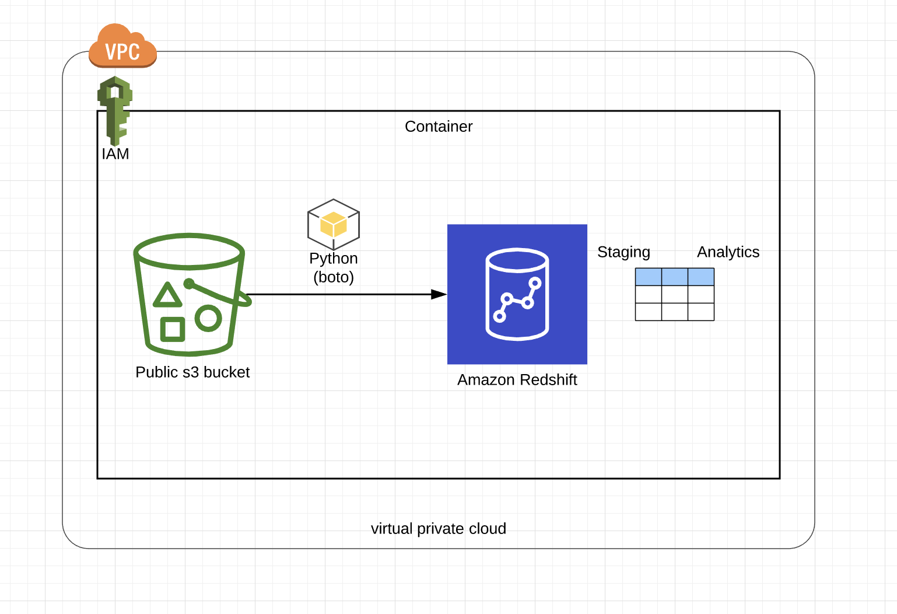
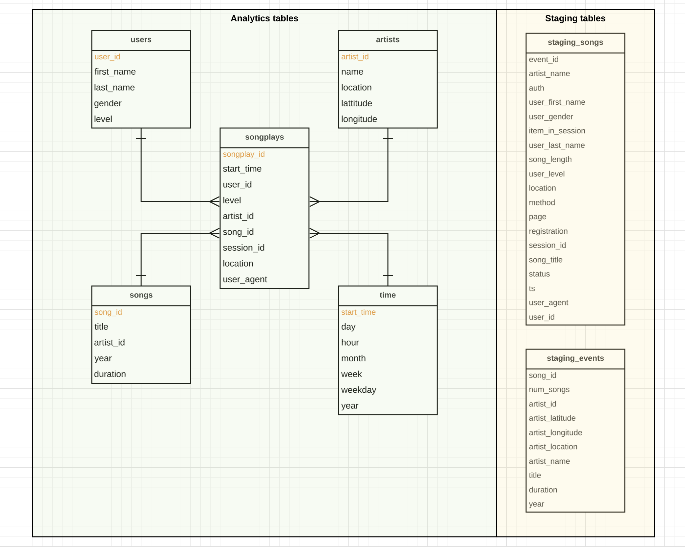

# Cloud Data Warehouse

## Song Play Analysis With S3 and Redshift

## Contents

- [Summary](#Summary)
- [Prerequisites](#Prerequisites)
- [Architecture](#Architecture)
- [Data Model](#Data-Model)
- [How to run this project](#How-to-run-this-project)

---

#### Summary

A music streaming startup, Sparkify, has grown their user base and song database and want to move their processes and data onto the cloud. Their data resides in S3, in a directory of JSON logs on user activity on the app, as well as a directory with JSON metadata on the songs in their app.

As their data engineer, I am tasked with building an ETL pipeline that extracts their data from S3, stages them in Redshift, and transforms data into a set of dimensional tables for their analytics team to continue finding insights in what songs their users are listening to. The database and ETL pipeline can be tested by running provided queries from the analytics team from Sparkify to compare with their expected results.

#### Prerequisites

##### Resources

###### The project will use the following resources in AWS

- [S3](https://aws.amazon.com/en/s3/) (Data storage `object storage`)  
  Amazon Simple Storage Service (Amazon S3) is an object storage service that offers industry-leading scalability, data availability, security, and performance.

- [Redshift](https://aws.amazon.com/en/redshift/) (Cloud Data warehouse with `columnar storage`)  
  Amazon Redshift is the world's fastest and most popular cloud data warehouse today and gets dramatically faster every year.

##### Data

###### Data details can be found by using the link below

- [Data](./data_description.md)

#### Architecture

The image below shows the architchure used in this project

#### Data Model

The image below shows the data model used in this project for the analytics (star schema) as well as the data staging

#### How to run this project

Run the scripts below in the described order to run this project.

1. Create the redshift cluster by running the [`Create Cluster`](./create_redshift_cluster.py) script
2. Wait for the cluster to be up and healthy. Log into your [`AWS console to verify`](https://us-west-2.console.aws.amazon.com/redshift/)
3. Run the [`Open TCP Port`](./open_tcp_port.py) script to open a port to allow access to redshift. This scipt also has utility that describes the cluster details like endpoint.
4. Create all tables in redshift for both the analytics tables and the staging tables. [`Create table`](./create_tables.py) script contains all the necessary functions for creating and dropping tables.
5. Load data into the tables by running the [`ETL`](./etl.py) script
6. Go to redshift console and click `query editor`. Under `schema`, select `Public` and we should see all the tables we just created.

##### Note

- The [`SQL Queries`](./sql_queries.py) script contains all the scripts for creating, dropping and loading tables with data.
- `Remember to delete the redshift cluster` by running the [`Delete Cluster`](./delete_redshift_cluster.py) script. Failure to do so will lead to significant charges from AWS.
- A sample `configiration` file is included. This file details should be filled out and the name should be changed from `sample_dwh.cfg` to `dwh.cfg`
- Data sources for this project are provided. See the [`Data`](./data_description.md) section.
